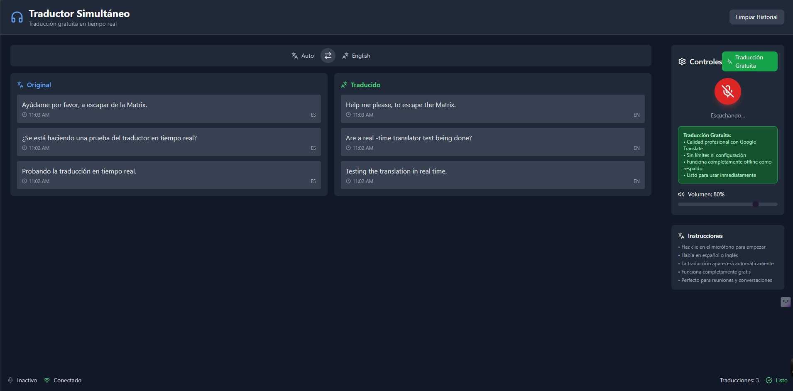

## Traductor Simultáneo (Gratis y en Tiempo Real)

Aplicación React + Vite que escucha tu micrófono, transcribe con la Web Speech API y traduce automáticamente entre español y otros idiomas usando servicios gratuitos (Lingva/MyMemory) con respaldo offline básico. También reproduce por voz la traducción con SpeechSynthesis.

### Demo

### Características

- **Reconocimiento de voz**: Web Speech API (Chrome/Edge/Safari/Opera)
- **Traducción gratuita**: Lingva (proxy de Google Translate) → MyMemory → diccionario básico offline
- **Síntesis de voz (TTS)**: lee la traducción en `es-ES` o `en-US`, con control de volumen
- **Detección automática de idioma** (cuando el origen está en `Auto`)
- **UI moderna** con controles: iniciar/detener escucha, volumen, intercambio de idiomas y limpieza de historial
- **Sin claves** ni configuración obligatoria para empezar

### Uso

1. Presiona el botón de micrófono para comenzar a escuchar.
2. Habla en español o en cualquier idioma. La app detecta el idioma si el origen está en `Auto`.
3. Verás el texto original a la izquierda y la traducción a la derecha.
4. La traducción se reproduce por voz automáticamente en el idioma destino.
5. Ajusta el volumen desde el panel lateral. Puedes intercambiar idiomas cuando quieras.

### Privacidad

- El reconocimiento de voz se realiza mediante la Web Speech API del navegador.
- Las traducciones usan endpoints públicos gratuitos (Lingva/MyMemory). No se almacenan datos en servidores propios de este proyecto.

### Licencia

MIT. Puedes usar y modificar libremente. Agradecimientos a los servicios gratuitos utilizados.

