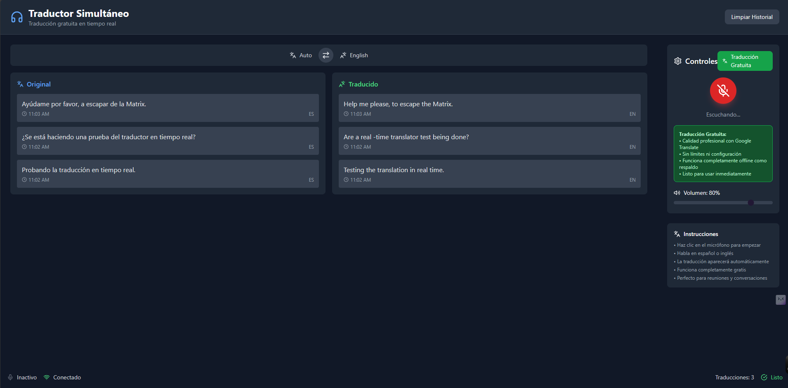

  <h1>🌐 Real-Time Translate</h1>
  
<strong>Traducción e Interpretación Simultánea por Voz en Tiempo Real</strong>

  

    
    
    
    
    
  

   

  

 

## 🌟 Descripción

**Real-Time Translate** es una solución web moderna diseñada para romper las barreras del idioma en conversaciones y reuniones. Permite escuchar la voz a través del micrófono, transcribirla en tiempo real y traducirla de manera instantánea a múltiples idiomas, reproduciendo automáticamente el resultado con síntesis de voz natural.

Todo funciona de manera **fluida, gratuita y sin necesidad de configurar llaves de API (API Keys)**.

---

## ✨ Características Destacadas

| Función | Descripción |
| :--- | :--- |
| 🎙️ **Reconocimiento de Voz** | Captura continua en tiempo real mediante la **Web Speech API** nativa del navegador. |
| 🔄 **Traducción Multinivel** | Sistema de tolerancia a fallos: **Lingva API** → **MyMemory** → **Diccionario Offline**. |
| 🔊 **Síntesis de Audio (TTS)** | Reproducción de voz automática de la traducción con control de volumen dinámico. |
| 🌐 **Detección Automática** | Identificación inteligente del idioma de origen cuando se selecciona el modo `Auto`. |
| ⚡ **Zero Setup & Free** | Acceso inmediato sin suscripciones, registros ni claves de API requeridas. |
| 🎨 **Interfaz Ultra Fluida** | Diseño limpio, accesible y responsivo construido con Tailwind CSS. |

---

## 🎯 Modo de Uso

1. **Activar Micrófono:** Haz clic en el botón principal de micrófono para iniciar la escucha continua.
2. **Hablar Naturalmente:** Expresa tus ideas en español o en el idioma seleccionado. Si usas el modo `Auto`, el sistema detectará el idioma inicial.
3. **Lectura y Reproducción Instantánea:** Observa la transcripción en vivo a la izquierda y la traducción en tiempo real a la derecha. El sistema leerá automáticamente la traducción.
4. **Control Total:** Ajusta el volumen del audio, intercambia idiomas de origen y destino con un solo clic o limpia el historial cuando lo necesites.

---

## 🛡️ Privacidad y Seguridad

- **Procesamiento Local de Voz:** La captura y reconocimiento de voz ocurren directamente en tu navegador usando APIs estándar de la Web.
- **Sin Almacenamiento Remoto:** Las peticiones de traducción utilizan proxies públicos y no se guardan registros ni datos personales en servidores propios.

---

## 📄 Licencia

Este proyecto está bajo la Licencia **MIT**. Consulta el archivo de licencia para más detalles.

  Desarrollado con ❤️ para impulsar la comunicación global sin barreras.

